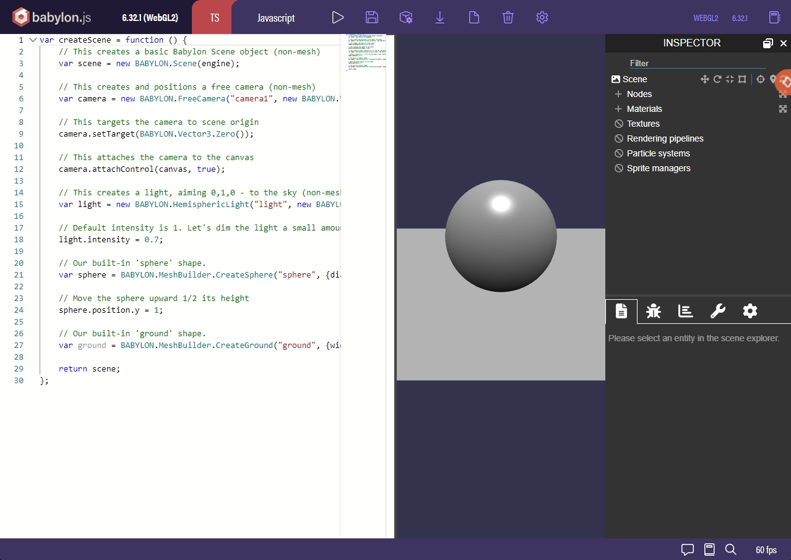
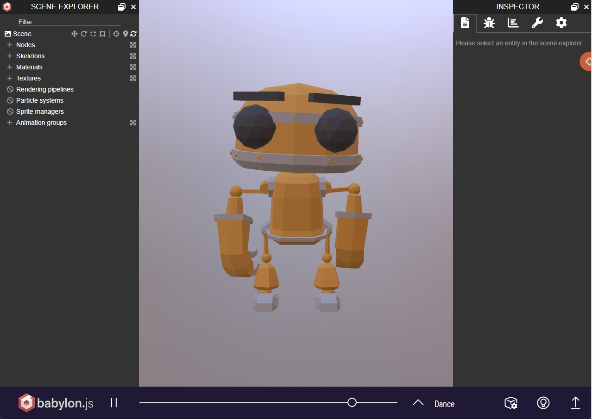
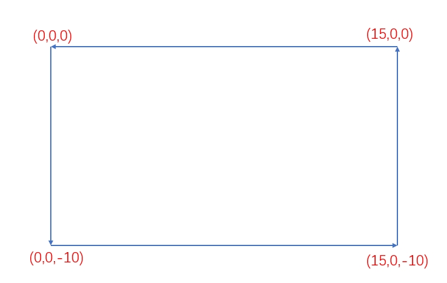
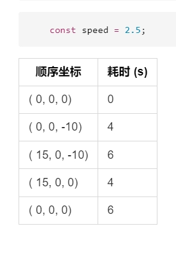
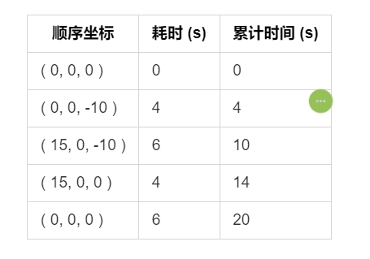

# AnimationCurveEditor

## 基础知识

动画曲线编辑器是 BABYLON.Inspector 当中一个非常强大的特性功能, 所以想要使用 动画编辑器就必须先引入 Inspector 模块, 其中有两种非代码方式可以在线使用 Inspector 功能

* [Babylon Playground](https://playground.babylonjs.com/) 
* [Babylon Sandbox](https://sandbox.babylonjs.com/) 
  

> 需要说明的是，这两个在线站点都有一些限制， playground 站点是 一个快速协同 的 babylonjs运行平台, 所以如果需要导入自己提供的 glb 文件，需要首先提供一个 互联网能访问的模型加载地址。 sandbox 是一个模型检测 debug 站点，用户可以在这里检查自身的模型是否正常，但是无法同时导入多个 模型文件。 如果需要使用到自身提供的多个 3d 模型文件的话，就需要使用代码方式引入 [Inspector 模块](../Insepector.md)。

## 动画须知

在使用动画编辑器之前，首先需要了解，babylonjs 中的动画 其实就是 按顺序执行的一系列帧画面，所以，如果了解了每一帧 模型对象的属性值，就可以制作出对应的动画了。

## 动画制作

1. 获取到总帧数，以及特定行为(转向移动)的对应帧数。
    > 这一步是动画制作最重要的一步，总体上可以参考物理位移原理来合理设计帧数 

   * 首先获取到物体运动的路线图，记录下每一个特殊(转向移动)帧 模型对象所在的坐标(这里可以使用Inspector 当中的坐标拾取功能以及 位移 gizmo 工具来快速获取) 
     
   * 可以给物体运动设置一个固定速度，比如每秒 2.5 个单位，使用坐标算出来 每个坐标到坐标的距离，除以时间便是每个单独路径的耗时 
     
    
   * 然后需要计算累计耗时
     
    
   * 累计耗时乘以 默认 每秒渲染的帧数， 就可以得到最终的 动画帧数据了 
   **切记不要忘了乘每秒帧数，默认每秒60帧**

2. 

