# AnimationCurveEditor

[BabylonJS Animation Curve Editor Intro Link](https://doc.babylonjs.com/toolsAndResources/inspector/animationCurveEditor)

## 基础知识

动画曲线编辑器是 BABYLON.Inspector 当中一个非常强大的特性功能, 所以想要使用 动画编辑器就必须先引入 Inspector 模块, 其中有两种非代码方式可以在线使用 Inspector 功能

* [Babylon Playground](https://playground.babylonjs.com/) 
* [Babylon Sandbox](https://sandbox.babylonjs.com/) 
  

> 需要说明的是，这两个在线站点都有一些限制， playground 站点是 一个快速协同 的 babylonjs运行平台, 所以如果需要导入自己提供的 glb 文件，需要首先提供一个 互联网能访问的模型加载地址。 sandbox 是一个模型检测 debug 站点，用户可以在这里检查自身的模型是否正常，但是无法同时导入多个 模型文件。 如果需要使用到自身提供的多个 3d 模型文件的话，就需要使用代码方式引入 [Inspector 模块](../Insepector.md)。

## 动画须知

在使用动画编辑器之前，首先需要了解，babylonjs 中的动画 其实就是 按顺序执行的一系列帧画面，所以，如果了解了每一帧 模型对象的属性值，就可以制作出对应的动画。

## Curve Editor

使用动画编辑器有两种场景
* 选中一个模型对象，选择右侧对象的 Animations 属性，点击 Editor 就可以新增或修改动画 
  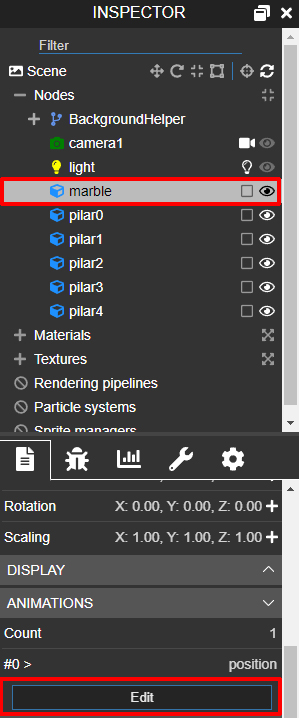
  
* 选中一个模型的 AnimationGroup ,即可编辑 Group 中每个单独动画 
  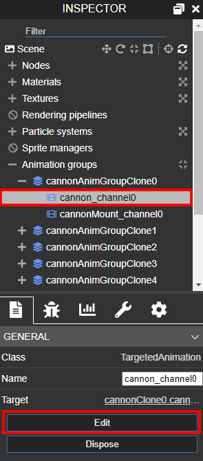

> 一般来说简单的动画只需要对模型对象新建 Animations 动画，AnimationGroup 场景不多见

### 菜单说明

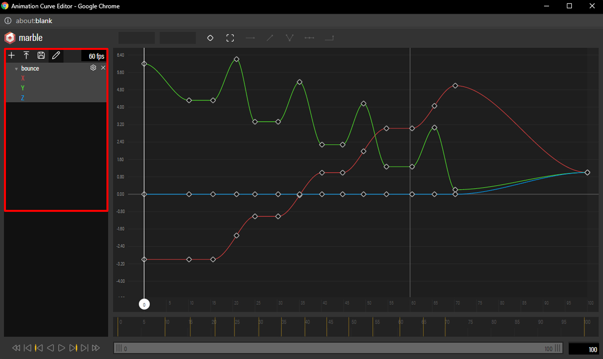

上图即为动画编辑器的菜单界面，我们对属性做一一介绍

*  "+" 按钮即为创建动画按钮，一个动画编辑器中可以对对象创建多个动画
  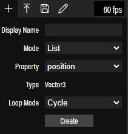
   * Display Name 为动画名称
   * Mode 为 List 即为内置的模型属性，Custom 即为 自定义的模型属性
   * Property 取决于 Mode 的选择模式，一般List 情况下就能够下拉选择到 position rotation 等常用属性
   * Type 即 property 的数据类型，这个也和代码创建动画的参数是一致的
   * Loop Mode 用来决定 动画播放模式，是循环播放还是只播放一次等等
*  第二个箭头符号 则表示用户可以上传动画内容，和下一个保存按钮中的保存为 json  文件中的格式保持对应。
*  保存按钮， 可以保存到 babylon 的在线服务器也可以保存为 json 文件
*  编辑按钮，可以编辑现有的动画内容
*  每秒显示帧数, fps 支持用户自定义修改

接下来介绍编辑器主体部分的帧控制面板。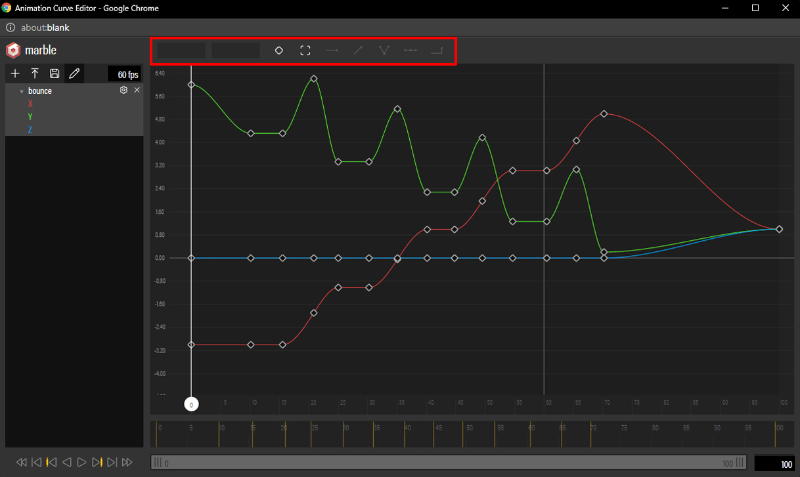


* 当前 key 帧数，当用户选中一个 key 时,可以通过这个输入框来修改 当前 key 的帧号 (**选中一个key时**)
* 当前 key value 当用户选中一个 key 时，可以通过这个输入框来修改当前 key 的属性具体值 (**选中一个key时**)
* 创建关键 key, 这个按钮将会再 整个播放轴上 创建一个 新的 关键 key， 并且将 渲染画布此时 网格对象的对应属性值 作为 新创建 key 的属性值，(换句话说，可以在 inspect 页面通过 gizmo 工具拖动旋转物体到指定位置，点击创建 关键 key 按钮就能创建一个新的关键 key , 并将手动拖动的网格对象的属性值作为 该关键 key 的value 值)
* 帧画布 ，这个按钮会自适应当前设定的 关键 key， 当在设定的 key value 超出画布时，可以使用该按钮来重置画布。

接下来的 5 个按钮都是用来控制 每个 关键 key 和前后帧 的 value 之间的变化关系，也就是关键 key 的左右切线
* 平铺切线，会让当前关键 key 的左右切线都变成 水平线，在这种情况下，由于 左右斜率一致，我们可以做出一些更加平滑的曲线效果出来。
* 线性切线，会让当前关键 key 的左右切线都变成 指向 前后关键 key 的 一次线条，一般用来展示一些匀速变化关系。
* 切分左右切线模式，可以单独的控制 关键 key 的左右切线。
* 整合左右切线模型，如上，切分模式的反面
* 阶梯式切线，在从 当前 key 到 下一个 key 之间的帧，value 值保持不变，在下一个关键 key 到来时，value 瞬间切换到该 key value，可以用来制作一些转身，旋转的瞬时动画。
  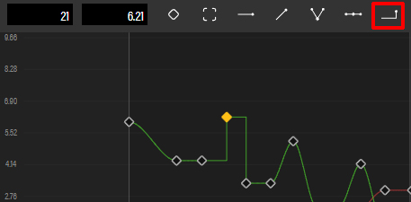

最后是动画播放面板
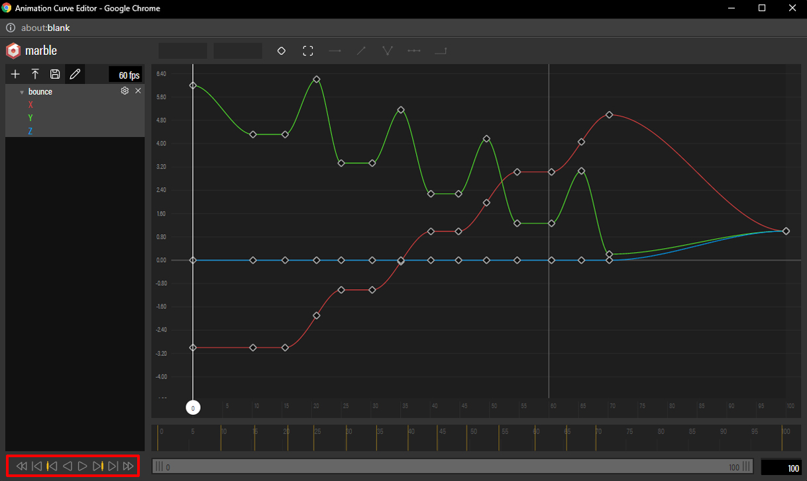

* 第一帧和最后一帧
  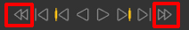
* 前一帧和后一帧
  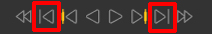
* 前一个和后一个关键 key 
  
* 播放和倒放动画
  
* 播放范围，需要指定动画开始和结束播放帧数
  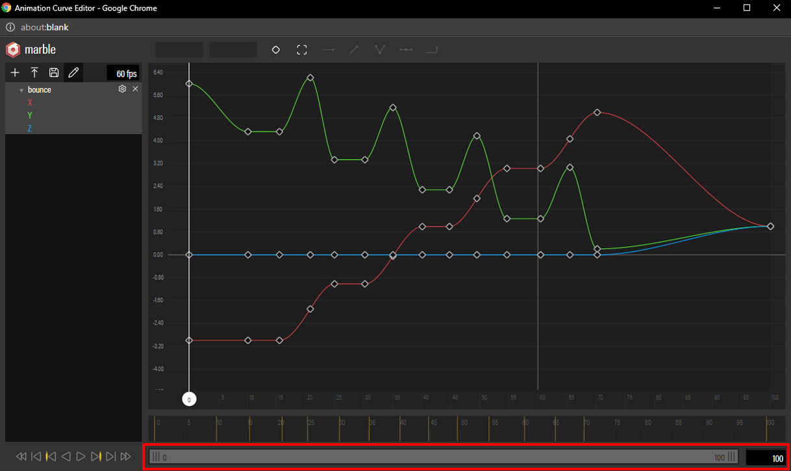


正常情况下，指定了动画属性值和播放模式之后，就可以点击创建 关键 key 来设定关键动画值，一方面可以在 inspector 中手动拖动网格对象，让新建key来获取指定 value, 另一方面也可以在 动画播放面板反复查看修改动画属性，制作好动画之后，就可以使用保存按钮来将制作好的动画导入了。对于历史动画也可以通过导入按钮来对动画做细节调整。
  


## 动画制作(实战)

当动画路线比较复杂，而且对动画速度时机的展示要求比较高得情况下，就需要先提前大概算出来动画得关键参数。这里以绕场一周动画为例，说明下步骤

1. 获取到总帧数，以及特定行为(转向移动)的对应帧数。
    > 这一步是动画制作最重要的一步，总体上可以参考物理位移原理来合理设计帧数 

   * 首先获取到物体运动的路线图，记录下每一个特殊(转向移动)帧 模型对象所在的坐标(这里可以使用Inspector 当中的坐标拾取功能以及 位移 gizmo 工具来快速获取)
    
     
   * 可以给物体运动设置一个固定速度，比如每秒 2.5 个单位，使用坐标算出来 每个坐标到坐标的距离，除以时间便是每个单独路径的耗时 
        
     
    
   * 然后需要计算累计耗时

     
    
   * 累计耗时乘以 默认 每秒渲染的帧数， 就可以得到最终的 动画帧数据了 
   **切记不要忘了乘每秒帧数，默认每秒60帧**

2. 引入 Inspetor, 打开动画编辑器，新建动画
   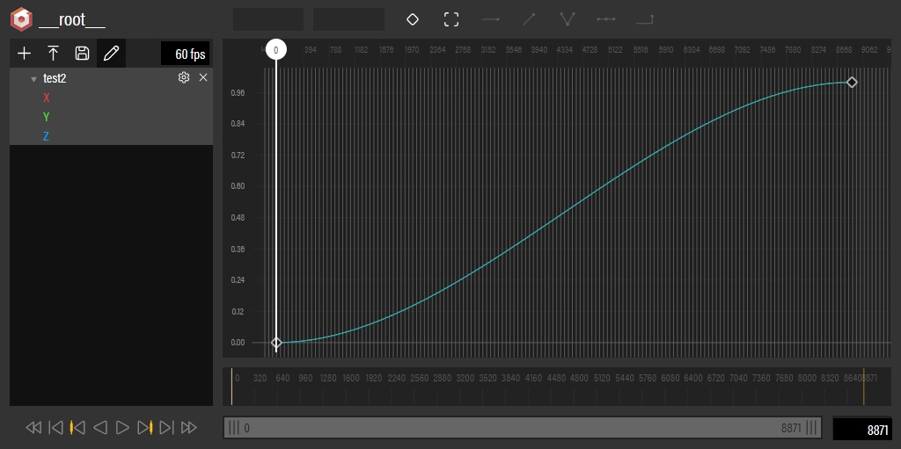

   我们在 1 中 计算了总帧数为 20*60 = 1200, 修改动画播放范围
   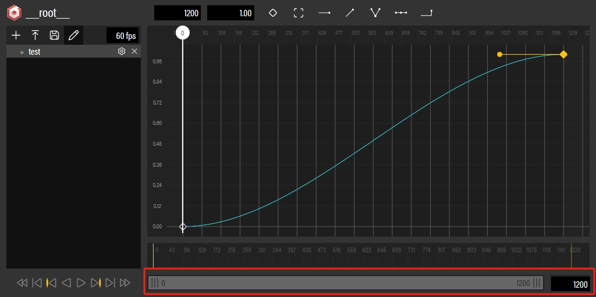

   注意到网格对象全程 y 坐标都是 0 ，我们可以先确定 y 轴动画
   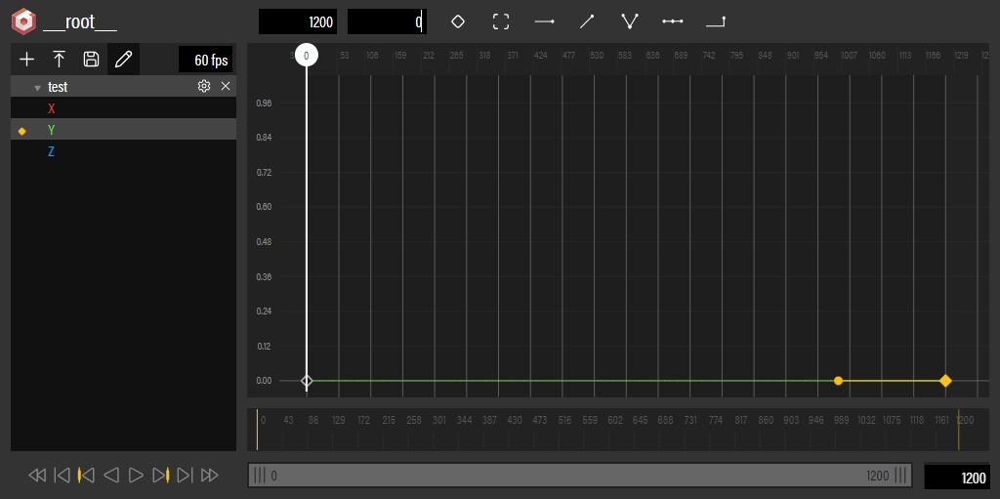

   然后按照创建 新 key => 设定新key frame value => 播放动画方式来创建新key
   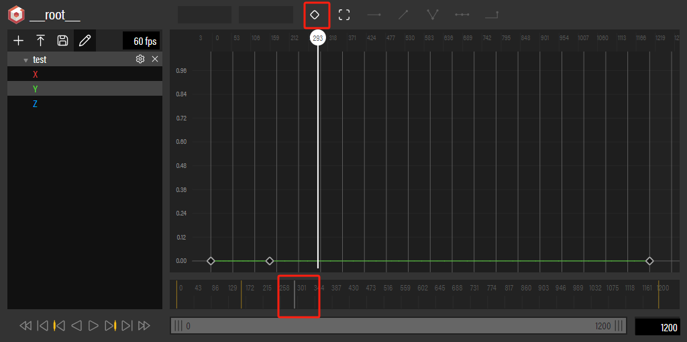
   
   通过切线按钮可以调整动画之前得线性关系
   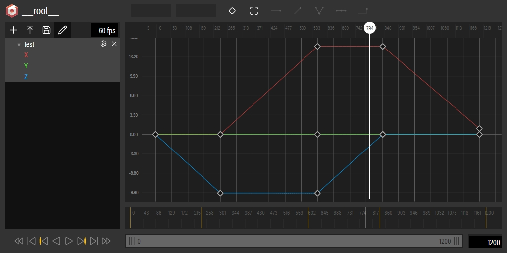

3. 保存按钮，点击导出成 file, 在代码中可以通过两种方式来导入动画内容
   
   ```javascript
  // url 文件方式
    let animation = Animation.ParseFromFileAsync(null,urlPath)
  // json hard-code
    var json = animationJson; // 将动画文件内容写死在代码里
    let animation = [Animation.Parse(animationJson[0])];
    
    // 直接执行动画，或者包装成 animationGroup 来执行，后者封装性更好；
    let robot.animations= animation;
     scene.beginAnimation(robot,0,8871,true);

    // animatioinGroup
      let robotAnimation = new BABYLON.AnimationGroup("robotAnim",scene);
      robotAnimation.addTargetedAnimation(animations[0],car);
      robotAnimation.addTargetedAnimation(animations[1],car);
      robotAnimation.from = 0;
      robotAnimation.to = 3120;
      robotAnimation.start(true,1,carAnimation.from,carAnimation.to,false);
   ```


